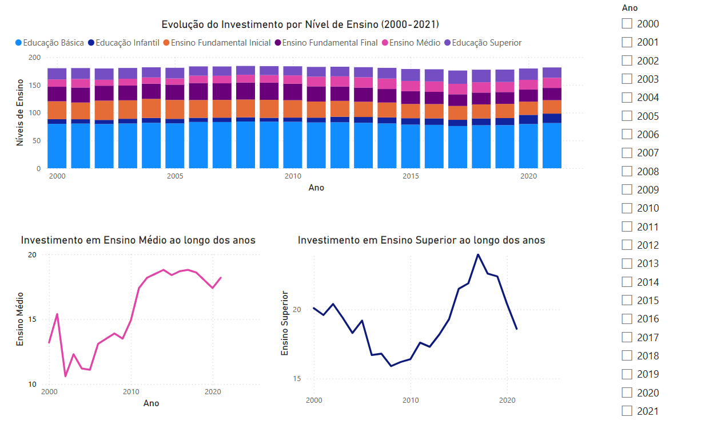

# 🎓 Análise de Investimento em Educação no Brasil (2000–2021)

Este projeto analisa a proporção de investimento público em diferentes níveis de ensino no Brasil, utilizando dados do INEP (Instituto Nacional de Estudos e Pesquisas Educacionais Anísio Teixeira).

## 🔍 Objetivo
Explorar como o investimento foi distribuído ao longo dos anos entre:
- Educação Infantil
- Ensino Fundamental
- Ensino Médio
- Educação Superior

## ⚙️ Ferramentas utilizadas
- Databricks (PySpark)
- Power BI
- Python
- Pandas

## 📊 Visualizações
O dashboard interativo foi feito no Power BI com base no CSV processado via Spark:

## 📁 Estrutura do projeto
- `projeto.csv`: dados finais para visualização
- `projeto.ipynb`: notebook com análise em PySpark
- `investimento.pbix`: arquivo do Power BI
- `dashboard_powerbi.png`: imagem do dashboard final

## 🧠 Aprendizados
- Coleta, limpeza e transformação de dados educacionais
- Leitura de Excel no Spark com pacote externo
- Visualização de tendências de investimento público
